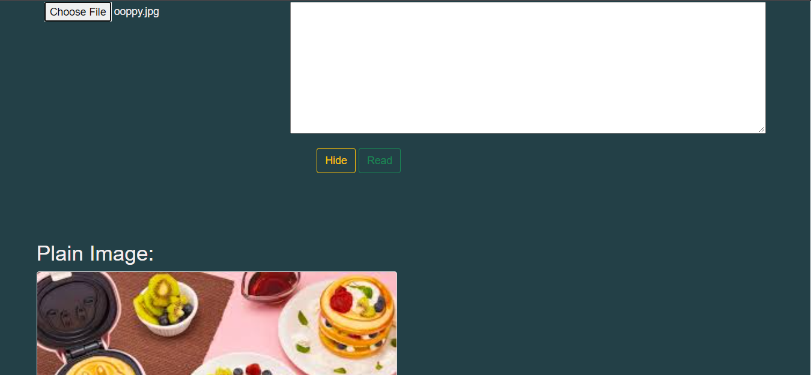
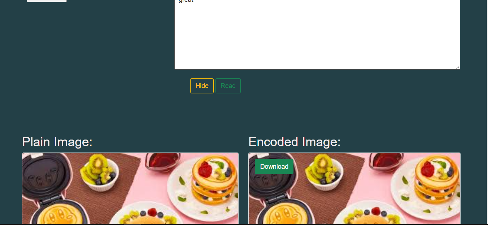
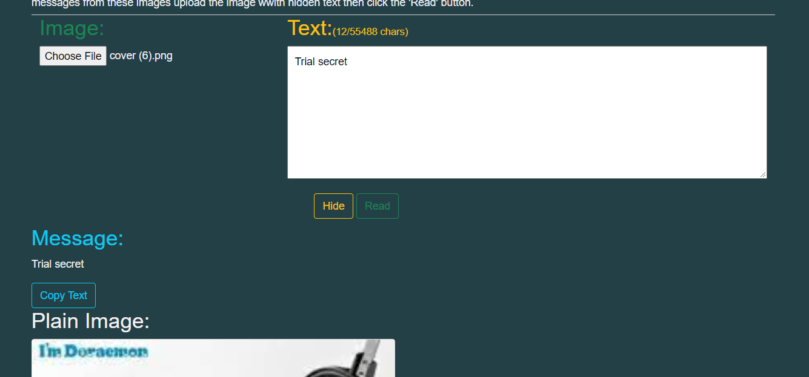
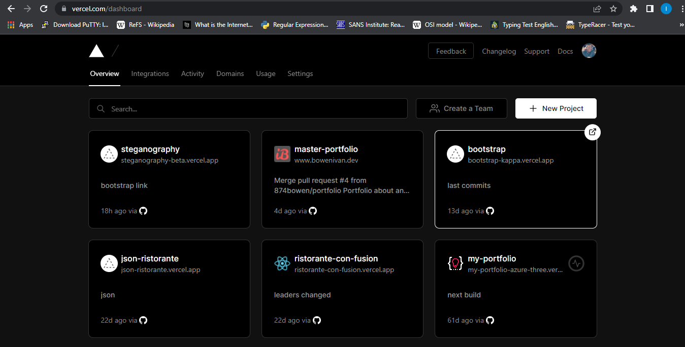
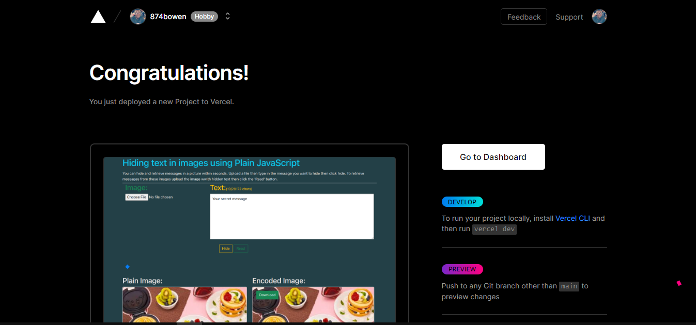

# Hiding text in Images using Plain JavaScript

Steganography is the process of concealing information in an image or any other digital artifact. Steganography is used to conceal text from unauthorized parties. With JavaScript we can easily use steganography.js to assist us in hiding/encoding data inside images and decoding/viewing the hidden message. Let's explore on how we can achieve this.

## Github

Check out the complete source code in this   [GitHub Repository](https://github.com/874bowen/steganography-with-js.git).

## Pre-requisites
To follow along through this article you are required to have: 
- Basic knowledge of HTML
- Knowledge in Javascript
- Some knowledge in Bootstrap

## Introduction
We will be using a JavaScript library by Peter Eigenschink [steganography.js](https://www.peter-eigenschink.at/projects/steganographyjs/) to build our project. You can download the library [here](https://www.peter-eigenschink.at/projects/steganographyjs/). This library offers two great functions to decode and encode text in images and abstracts the code behind these functions.

- ```encode``` takes a message as String and a image as Image, HTMLImageElement or String representing the data-URL of the cover image. Returns the data-URL of the image with the encoded message inside.
- ```decode``` takes an image as Image, HTMLImageElement or String representing the data-URL of the image and returns the message which was found in the image.


```bash
git clone https://github.com/874bowen/steganography-with-js.git
```


## Usage
After cloning you can open the ```index.html``` file in your browser. Make sure the ```steganography.min.js``` from the library downloaded is in your js folder. Now let's examine the ```scripts.js``` file. 
### Writing the handleFileSelect to handle uploaded image
```javascript
function handleFileSelect(evt) {
    var original = document.getElementById("original"),
        stego = document.getElementById("stego"),
        img = document.getElementById("img"),
        cover = document.getElementById("cover"),
        message = document.getElementById("message");
    if(!original || !stego) return;
    var files = evt.target.files; 
    for (var i = 0, f; f = files[i]; i++) {
        if (!f.type.match('image.*')) {
            continue;
        }
        var reader = new FileReader();
        reader.onload = (function(theFile) {
            return function(e) {
                img.src = e.target.result;
                img.title = escape(theFile.name);
                stego.className = "half invisible";
                cover.src = "";
                message.innerHTML="";
                message.parentNode.className="invisible";
                updateCapacity();
            };
        })(f);
        reader.readAsDataURL(f);
    }
}
```
- ```handleFileSelect(evt){...}```this function first returns the elements with their specific values required for our project and stores them in appropriate variables so they can be easily referenced in our function.  
    ```javascript
    var original = document.getElementById ("original"),
        stego = document.getElementById("stego"),
        img = document.getElementById("img"),
        cover = document.getElementById("cover"),
        message = document.getElementById("message");
    ```
- if the value in ```original``` and ```stego``` is ```null``` it should return nothing.
    ```javascript
    if(!original || !stego) return;
    ```
- To access the list of files where ```type='file'``` using the ```target.files```
    ```javascript
    var files = evt.target.files;
    ```
  We are going to loop the list of files and make sure that the files we are to process are of type image
  ```javascript
    if (!f.type.match('image.*')) {
        continue;
    }
    ```
  To read data from an image which is a Binary Large Object(BLOB) we need to create an object of type FileReader
    ```javascript
    var reader = new FileReader();
    ```
  ```load``` is one of the events triggered in process of reading the file. Whe the image loads we are going to capture the information on it and set some classes to some of our elements.
    ```javascript
    reader.onload = (function(theFile) {
        return function(e) {
            img.src = e.target.result;
            img.title = escape(theFile.name);
            stego.className = "half invisible";
            cover.src = "";
            message.innerHTML="";
            message.parentNode.className="invisible";
            updateCapacity();
        };
    })(f);
    ```
- When the uploaded file loads we want render the uploaded image to the left make the encoded image and the message section ```invisible``` It also checks whether the tags with id of ```img``` and ```text``` have values and computes the number of characters in the textarea field by invoking the ```updateCapacity()``` function as shown above.
    ```javascript
    function updateCapacity() {
            var img = document.getElementById('img'),
                textarea = document.getElementById('text');
            if(img && text)
                document.getElementById('capacity').innerHTML='('+textarea.value.length + '/' + steg.getHidingCapacity(img) +' chars)';
        }
    ```
  The Image shows what the ```handleFileSelect()``` function achieves.

    

### Writing the hide function to encode the text
```javascript
function hide() {
    var stego = document.getElementById("stego"),
        img = document.getElementById("img"),
        cover = document.getElementById("cover"),
        message = document.getElementById("message"),
        textarea = document.getElementById("text"),
        download = document.getElementById("download");
    if(img && textarea) {
        cover.src = steg.encode(textarea.value, img);
        stego.className = "half";
        message.innerHTML="";
        message.parentNode.className="invisible";
        download.href=cover.src.replace("image/png", "image/octet-stream");
    }
}
```


- ```hide(){...}``` This function also returns the elements with their specific values using the ```document.getElementById``` 
- If both the `img` and `textarea` values are not `null` we are going to **encode** our text inside the uploaded image.
    ```javascript
    cover.src = steg.encode(textarea.value, img);
    ```
 >```steganography.js``` provides an object called ```steg``` which we can invoke the ```encode``` method and having the text as ```textarea.value``` and image as ```img``` as arguments to the method.
  

    To download the encoded image using HTML5 we can add the download attribute to our download button link
```html
<a id="download" class="btn btn-success" download="cover.png" rel="nofollow">Download</a>
```
We will also need to change the type of our image to an **_octet-stream_** so that when you download it with a missing extension or unknown format your system will recognize it as an octet-file(binary file).
```javascript
download.href=cover.src.replace("image/png", "image/octet-stream");
```

### Writing the read function to encode the text
```javascript
function read() {
    var img = document.getElementById("img"),
        cover = document.getElementById("cover"),
        message = document.getElementById("message"),
        textarea = document.getElementById("text");
    if(img && textarea) {
        message.innerHTML = steg.decode(img);
        if(message.innerHTML !== "") {
            message.parentNode.className="";
            textarea.value = message.innerHTML;
            updateCapacity();
        }
    }
}
```
- ```read()```This function also returns the elements with their specific values using the ```document.getElementById``` used in our read function.

  If the `textarea` and `img` field has values, `decode` the text inside the encoded image.
    ```javascript
    message.innerHTML = steg.decode(img);
    ```
>```decode``` function by steganography.js decodes the encoded image and retrieves the text encoded in the image.

If the message field has a value copy it to the textarea field and this time let's make the div **visible** unlike we did with the two functions above.
 ```javascript
if(message.innerHTML !== "") {
    message.parentNode.className="";
    textarea.value = message.innerHTML;
    updateCapacity();
}
```
The image below shows the effect of the `read` function.
 


## Deploying your application to vercel
When you have pushed your project to github. Go to [Vercel](https://vercel.com/signup?next=%2Fdashboard) and sign up with github. Go to dashboard  Click new project and import your github project. Click deploy to deploy your project on Vercel.  Nice! we just deployed our application to vercel. Click [this link](https://steganography-with-js.vercel.app/) to view the deployed project.

## Conclusion
In conclusion, we saw how we can encode and decode text in images using steganography.js and JavaScript. We also learnt how to deploy our application on Vercel
